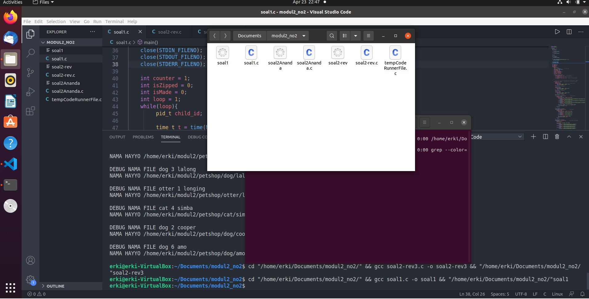
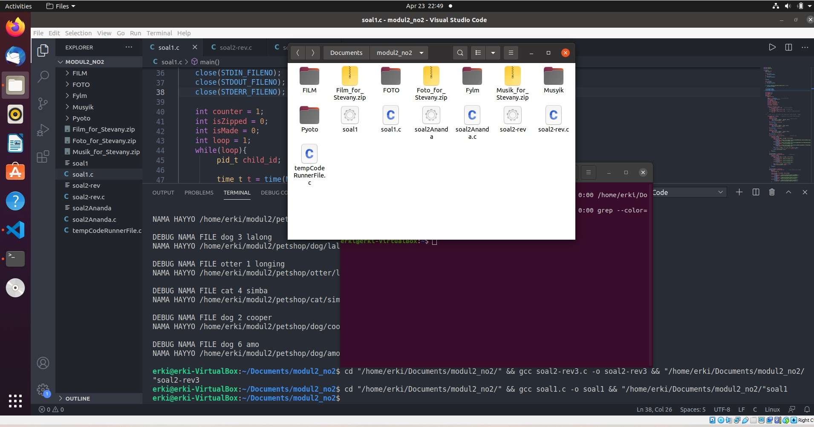
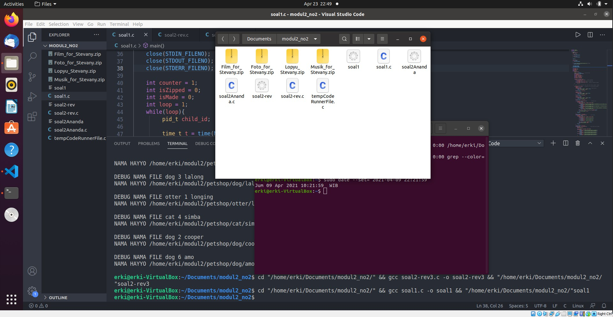
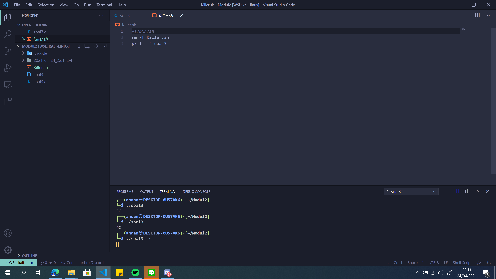
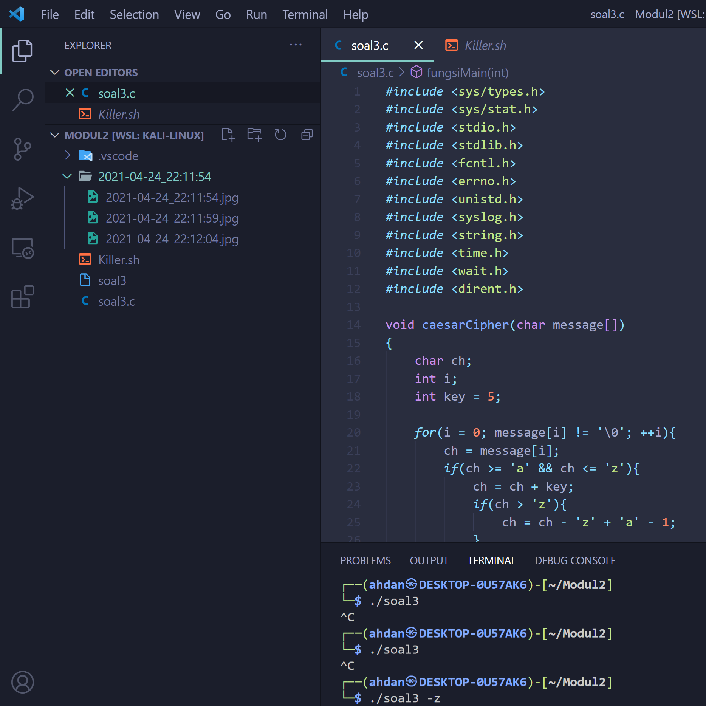
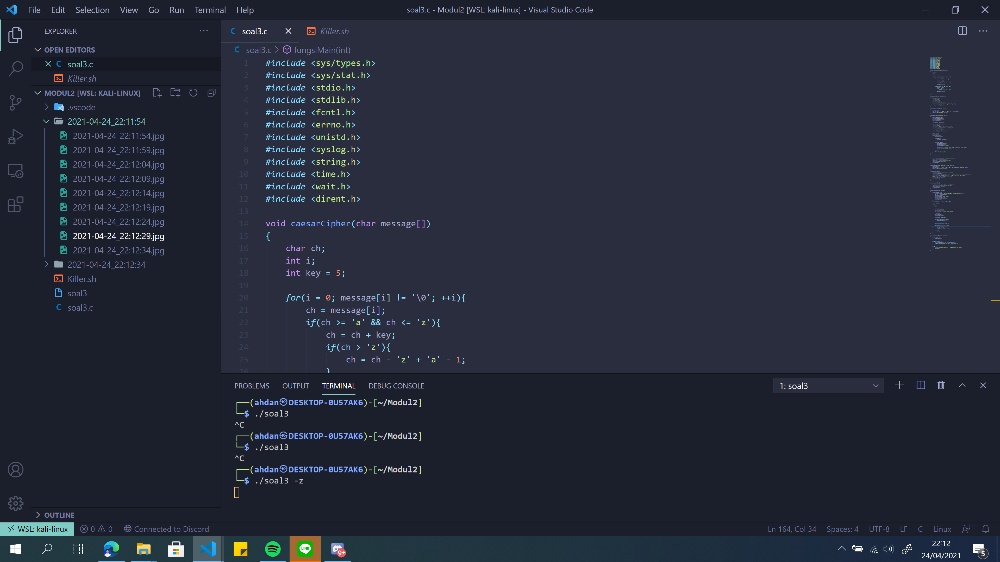
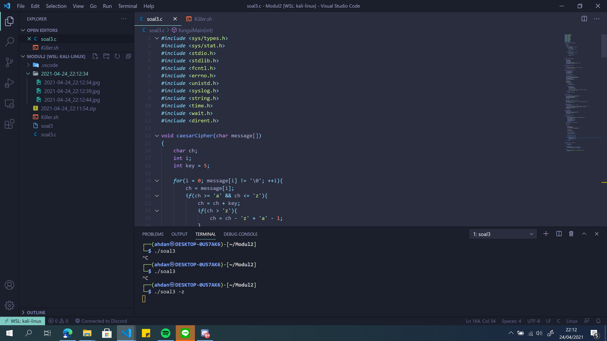
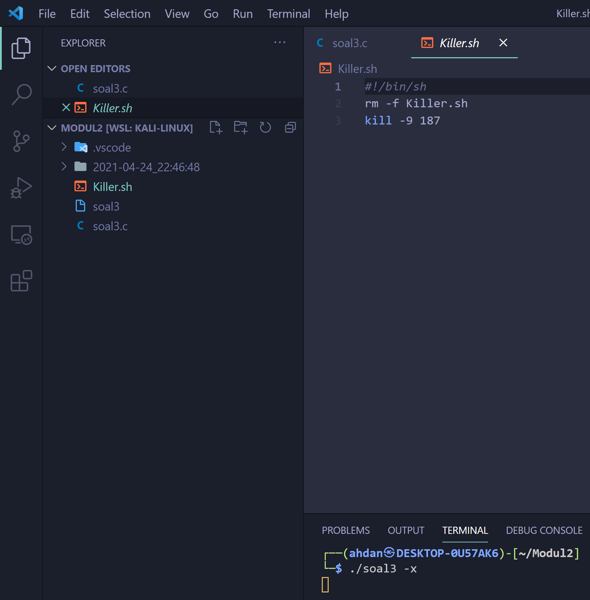

# soal-shift-sisop-modul-2-A01-2021

## Soal Nomor 1

Pada suatu masa, hiduplah seorang Steven yang hidupnya pas-pasan. Steven punya pacar, namun sudah putus sebelum pacaran. Ketika dia galau memikirkan mantan, ia selalu menonton https://www.youtube.com/watch?v=568DH_9CMKI untuk menghilangkan kesedihannya.

Di lain hal Steven anak yang tidak amat sangat super membenci matkul sisop, beberapa jam setelah diputus oleh pacarnya dia menemukan wanita lain bernama Stevany, namun Stevany berkebalikan dengan Steven karena menyukai sisop. Steven ingin terlihat jago matkul sisop demi menarik perhatian Stevany.

Pada hari ulang tahun Stevany, Steven ingin memberikan Stevany zip berisikan hal-hal yang disukai Stevany. Steven ingin isi zipnya menjadi rapi dengan membuat folder masing-masing sesuai extensi. (a) Dikarenakan Stevany sangat menyukai huruf Y, Steven ingin nama folder-foldernya adalah Musyik untuk mp3, Fylm untuk mp4, dan Pyoto untuk jpg (b) untuk musik Steven mendownloadnya dari link di bawah, film dari link di bawah lagi, dan foto dari link dibawah juga :). (c) Steven tidak ingin isi folder yang dibuatnya berisikan zip, sehingga perlu meng-extract-nya setelah didownload serta (d) memindahkannya ke dalam folder yang telah dibuat (hanya file yang dimasukkan).

(e) Untuk memudahkan Steven, ia ingin semua hal di atas berjalan otomatis 6 jam sebelum waktu ulang tahun Stevany). (f) Setelah itu pada waktu ulang tahunnya Stevany, semua folder akan di zip dengan nama Lopyu_Stevany.zip dan semua folder akan di delete(sehingga hanya menyisakan .zip). Kemudian Steven meminta bantuanmu yang memang sudah jago sisop untuk membantunya mendapatkan hati Stevany. Bantu Woy!!

### Penjelasan

Pada soal, dinyatakan bahwa program akan berjalan otomatis sehingga program akan dibuat dalam bentuk daemon. Terdapat 2 prosedur utama dalam program ini.

Pertama adalah membuat 3 folder sesuai format, mendownload file-file dari 3 link yang berbeda, meng-unzip file yang telah didownload, memindahkannya ke dalam folder yang dilakukan 6 jam sebelum hari ulang tahun Stevany yang jatuh pada tanggal 9 April pukul 22:22 yaitu pukul 16:22.

Kedua adalah melakukan zip kepada 3 folder yang telah diisi oleh file yang diperlukan dan menghapus folder yang tidak diperlukan. Prosedur ini dilakukan tepat pada hari ulang tahun Stevany.

### Solusi

Untuk representasi daemon, digunakan program sebagai berikut

```c
#include <sys/types.h>
#include <sys/stat.h>
#include <stdio.h>
#include <stdlib.h>
#include <fcntl.h>
#include <errno.h>
#include <unistd.h>
#include <syslog.h>
#include <string.h>
#include <wait.h>
#include <time.h>
#include <dirent.h>

int main(){
    pid_t pid, sid;
    pid = fork();

    if (pid < 0) {
        exit(EXIT_FAILURE);
    }
    if (pid > 0) {
        exit(EXIT_SUCCESS);
    }

    umask(0);

    sid = setsid();
    if (sid < 0) {
        exit(EXIT_FAILURE);
    }

    if ((chdir("/home/erki/Documents/modul2_no2/")) < 0) {
        exit(EXIT_FAILURE);
       }

    close(STDIN_FILENO);
    close(STDOUT_FILENO);
    close(STDERR_FILENO);

    int isZipped = 0;
    int isMade = 0;
    int loop = 1;
    while(loop){
        pid_t child_id;

         time_t t = time(NULL);          //to set up time
         struct tm *tm = localtime(&t);
         int isSixHours = 0;
         int isBirthday = 0;
         int date = tm->tm_mday;
         int month = tm->tm_mon + 1;
         int hour = tm->tm_hour;
         int minute = tm->tm_min;
         int second = tm->tm_sec;

         if(date == 9 && month == 4){
             if(hour == 16 && minute == 22)     //6 hours condition
                  isSixHours = 1;
             else if ( hour == 22 && minute == 22)  //birthday time
                  isBirthday = 1;
             else if ( hour == 10 && minute == 22)    //debug for stopping the daemon
                  loop = 0;
         }
          if(isSixHours && !isMade){
                isMade = 1;
                ....
          }
          if(isBirthday && !isZipped){
                isZipped = 1;
                ....
          }
    }
```

Variabel isMade dan isZipped digunakan agar tidak melakukan hal yang sama lebih dari sekali pada saat program berjalan secara otomatis. Variabel loop digunakan untuk melakukan debug penghentian program apabila waktu diatur pada jam tertentu. Untuk penentuan waktu, diperlukan sebuah `struct tm *` agar dapat melakukan pengesktrakan dari waktu yang ada. Untuk soal 1a-1d akan dijalankan di dalam `if (isSixHours && !isMade)` dan untuk soal 1e-1f akan dijalankan didalam ` if (isBirthday && !isZipped)`.

### No 1a

Untuk soal ini, dilakukan pembuatan 3 buah folder menggunakan fork dengan execv nama folder yang berbeda-beda menggunakan format nama tertentu.

```c
child_id = fork();
if(child_id == 0){                               //make directory
    char *argv[] = {"mkdir",  "Musyik", NULL};
    execv("/usr/bin/mkdir", argv);
}
while(wait(NULL) != child_id);

child_id = fork();
if(child_id == 0){
    char *argv[] = {"mkdir",  "Fylm", NULL};
    execv("/usr/bin/mkdir", argv);
}
while(wait(NULL) != child_id);

child_id = fork();
if(child_id == 0){
    char *argv[] = {"mkdir",  "Pyoto", NULL};
    execv("/usr/bin/mkdir", argv);
}
while(wait(NULL) != child_id);
```

### No 1b

Untuk soal ini, program harus mendownload file foto, video, dan film dari link yang telah disediakan.

```c
 for(int count=1 ;count<=3;count++){             //download files
    child_id = fork();
    if(child_id == 0){
        char directory[100], link[100], nameFile[100];
        if(count==1){
            strcpy(link, "https://drive.google.com/uc?id=1ZG8nRBRPquhYXq_sISdsVcXx5VdEgi-J&export=download");
            strcpy(nameFile, "Musik_for_Stevany.zip");
        }if(count==2){
            strcpy(link, "https://drive.google.com/uc?id=1ktjGgDkL0nNpY-vT7rT7O6ZI47Ke9xcp&export=download");
            strcpy(nameFile, "Film_for_Stevany.zip");
        }if(count==3){
            strcpy(link, "https://drive.google.com/uc?id=1FsrAzb9B5ixooGUs0dGiBr-rC7TS9wTD&export=download");
            strcpy(nameFile, "Foto_for_Stevany.zip");
        }
        char *argv[] = {"wget", "-q", link, "-O", nameFile, NULL};
    //    char *argv[] = {"wget",  link, "-O", nameFile, NULL};
        execv("/usr/bin/wget", argv);
    }
    sleep(15);
}
```

Untuk melakukannya, dilakukan pengulangan sebanyak 3 kali. Untuk setiap pengulangannya, link download file akan diset berbeda-beda. Terakhir, dilakukan `sleep(15)` untuk setiap pengulangan.

### No 1C

Untuk soal ini, program harus mengextract file yang telah didownload. Langkah ini dilakukan dengan program sebagai berikut

```c
 while(wait(NULL) != child_id);
    for(int count=1 ;count<=3;count++){           //unzip folder
        child_id = fork();
        if(child_id == 0){
            char directory[100], link[100], nameFile[100];
            if(count==1){
                strcpy(nameFile, "Musik_for_Stevany.zip");
            }if(count==2){
                strcpy(nameFile, "Film_for_Stevany.zip");
            }if(count==3){
                strcpy(nameFile, "Foto_for_Stevany.zip");
            }
            char *argv[] = {"unzip", nameFile, NULL};
            execv("/usr/bin/unzip", argv);
        }
        sleep(2);
    }
```

Untuk penamaan file, disesuaikan dengan jenis file yang didownload.

### No 1D

Untuk soal ini, program harus memindahkan file dari file yang telah diextract ke dalam file yang telah dibuat di soal 1a. Untuk melakukan ini, diperlukan sebuah pengulangan untuk melakukan read setiap file pada folder hasil extract dan memindahkannya ke dalam file yang baru.

```c
 while(wait(NULL) != child_id);
    for(int count=1 ;count<=3;count++){          //copy contents that unzipped
        DIR *dp;
        struct dirent* ep;

        char dest[100], source[100], nameFile[100];
        if(count==1){
                strcpy(source, "/home/erki/Documents/modul2_no2/MUSIK/");
                strcpy(dest, "/home/erki/Documents/modul2_no2/Musyik/");
        }if(count==2){
                strcpy(source, "/home/erki/Documents/modul2_no2/FILM/");
                strcpy(dest, "/home/erki/Documents/modul2_no2/Fylm/");
        }if(count==3){
                strcpy(source, "/home/erki/Documents/modul2_no2/FOTO/");
                strcpy(dest, "/home/erki/Documents/modul2_no2/Pyoto/");
        }
        dp = opendir(source);
        if(dp != NULL){
            while((ep = readdir(dp))){
                child_id = fork();
                if(child_id == 0){
                    // printf("DEBUG %s\n", ep->d_name); // debug print file
                    char file_source[355];
                    char file_dest[355];
                    sprintf(file_source, "%s%s", source, ep->d_name);
                    sprintf(file_dest, "%s%s", dest, ep->d_name);

                    if(strcmp(ep->d_name, ".") != 0 || strcmp(ep->d_name, "..") != 0){ //dont print current and parrent directory
                        char *argv[] = {"mv", file_source, file_dest, NULL};
                        execv("/usr/bin/mv", argv);
                    }
                }
            }
        }
    }
```

Untuk melakukan hal ini, diperlukan bantuan `struct dirent *` dan `DIR *` untuk melakukan read pada directory dan folder yang terdapat di dalamnya.

### No 1E

Untuk soal ini, program harus menzip folder yang telah diisi oleh file yang ada di folder extract.

```c
child_id = fork();
if(child_id == 0){       //zip all the folders
    char *argv[] = {"zip", "-r", "Lopyu_Stevany.zip", "Fylm", "Musyik", "Pyoto", NULL};
    execv("/usr/bin/zip", argv);
}
while (wait(NULL) != child_id);
```

`zip` menggunakan option `-r` untuk dapat melakukan `zip` directory beserta semua isi di dalamnya.

### No 1F

Untuk soal terakhir ini, program akan menghapus semua folder yang telah dibuat hingga hanya menyisakan folder zip dari hasil mendownload file dari link yang telah disediakan.

```c
child_id = fork();
if(child_id == 0){       //delete all unnecessary folders
    char *argv[] = {"rm", "-r", "Fylm", "Pyoto", "Musyik", "MUSIK", "FILM", "FOTO", NULL};
    execv("/usr/bin/rm", argv);
}
while (wait(NULL) != child_id);
```

option `-r` digunakan untuk menghapus directory bersama dengan semua file yang terdapat di dalamnya.

### Screenshot folder sebelum set waktu 6 jam dari waktu ulang tahun Stevany


### Screenshot folder saat set waktu 6 jam dari waktu ulang tahun Stevany


### Screenshot folder saat ulang tahun Stevany


## Soal nomor 2
Loba bekerja di sebuah petshop terkenal, suatu saat dia mendapatkan zip yang berisi banyak sekali foto peliharaan dan Ia diperintahkan untuk mengkategorikan foto-foto peliharaan tersebut. Loba merasa kesusahan melakukan pekerjaanya secara manual, apalagi ada kemungkinan ia akan diperintahkan untuk melakukan hal yang sama. Kamu adalah teman baik Loba dan Ia meminta bantuanmu untuk membantu pekerjaannya.

**a.** Pertama-tama program perlu mengextract zip yang diberikan ke dalam folder “/home/[user]/modul2/petshop”. Karena bos Loba teledor, dalam zip tersebut bisa berisi folder-folder yang tidak penting, maka program harus bisa membedakan file dan folder sehingga dapat memproses file yang seharusnya dikerjakan dan menghapus folder-folder yang tidak dibutuhkan.
**b.** Foto peliharaan perlu dikategorikan sesuai jenis peliharaan, maka kamu harus membuat folder untuk setiap jenis peliharaan yang ada dalam zip. Karena kamu tidak mungkin memeriksa satu-persatu, maka program harus membuatkan folder-folder yang dibutuhkan sesuai dengan isi zip.
```
Contoh: Jenis peliharaan kucing akan disimpan dalam “/petshop/cat”, jenis peliharaan kura-kura akan disimpan dalam “/petshop/turtle”.
```

**c.** Setelah folder kategori berhasil dibuat, programmu akan memindahkan foto ke folder dengan kategori yang sesuai dan di rename dengan nama peliharaan.
```Contoh: “/petshop/cat/joni.jpg”.```

**d.** Karena dalam satu foto bisa terdapat lebih dari satu peliharaan maka foto harus di pindah ke masing-masing kategori yang sesuai. Contoh: foto dengan nama “dog;baro;1_cat;joni;2.jpg” dipindah ke folder “/petshop/cat/joni.jpg” dan “/petshop/dog/baro.jpg”.
**e.** Di setiap folder buatlah sebuah file "keterangan.txt" yang berisi nama dan umur semua peliharaan dalam folder tersebut. Format harus sesuai contoh.
```
nama : joni
umur  : 3 tahun

nama : miko
umur  : 2 tahun
```
### Jawaban 2A
Soal 2A meminta kita untuk melakukan Unzip terhadap file petshop yang sudah didownload terlebihdahulu di modul soal.
dalam soal ini file yang diunzip hanyalah file dengan format gambar atau ".jpg" dan untuk filefolder yang tidak penting tidak perlu di-unzip
fungsi unzip:
```c
void unzipFile(char *pets){
  pid_t pid;
  pid = fork();
  if(pid == 0){
      char *args[] = {"unzip",  "-q", pets, "-d", FULL_PATH, NULL};
      execv("/usr/bin/unzip", args);
  }
  while(wait(NULL)!=pid);
}
```
fungsi menghapus file yang tidak perlu:
```c
void removeNotJpg(){
   struct dirent *dp;
   DIR *folder;
   folder = opendir(FULL_PATH);

    // printf("DEBUG removing %s\n", path);

   if(folder != NULL){  //open dire"%s/%s", PETSHOP_PATH, jenis);ctory
       while((dp = readdir(folder)) != NULL){  //read per names in the file
            if(strcmp(dp->d_name, ".") != 0 && strcmp(dp->d_name, "..") != 0){ // dont copy parent and current directory
                 if(dp->d_type == DT_DIR){
                      char removePath[400];
                      sprintf(removePath, "%s/%s", FULL_PATH, dp->d_name);

                      pid_t pid;
                      pid = fork();
                      if(pid == 0){
                         char *argv[] = {"rm", "-r", removePath, NULL};
                         execv("/usr/bin/rm", argv);  
                      }
                      while(wait(NULL) != pid);
                 }
            }
       }
   }
}
```
### Jawaban 2B
Soal 2B menginginkan kita untuk membuat sebuah direktori baru dengan format penamaan disesuaikan untuk tiap nama hewan yang menjadi format penamaan file gambar setelah di-unzip. untuk nama tiap file direktori hanya dinamai nama depan tiap dari hewan 
pembuatan sebah variabel yang berisi jenisnya:
```c
char *jenis = strtok(fileName, ";"),
        *nama = strtok(NULL, ";"), 
        *umur = strtok(NULL, ";");
    printf("DEBUG NAMA FILE %s %s %s\n", jenis, umur, nama);

    char jenisPath[400], txtPath[400], fileNamePath[400];
    sprintf(jenisPath, "%s/%s", FULL_PATH, jenis);
    sprintf(txtPath, "%s/%s/keterangan.txt", FULL_PATH, jenis);
    sprintf(fileNamePath, "%s/%s/%s.jpg", FULL_PATH, jenis, nama);
```
exec untuk membuat kategori baru berdasarkan jenis:
```c
pid = fork();                                              
    if(pid == 0) {
        char *args[] = {"mkdir", "-p", jenisPath, NULL};
        execv("/usr/bin/mkdir", args);
    }
    while(wait(NULL) != pid);
```

### Jawaban 2C
Pada soal ini, dilakukan pembuatan program yang memilikii tujuan memindahkan file gambaar ke dalam direktori baru dari soal 2B yang disesuaikan berdasarkan nama jenisnya dan setelah dimasukkan ke file folder baru maka file gambarnya akan direname sesuai nama hewan per gambar
exec untuk melakukan copy tiap gambar
```c
pid = fork();                                               
    if(pid == 0) {
        char *args[] = {"cp", sourcePath, fileNamePath, NULL};
        execv("/usr/bin/cp", args);
    }
    while(wait(NULL) != pid);
```
setelah dicopy maka tidak ada file gambar yang ada di luar direktori maka akan dilakukan penghapusan gambar menggunakan:
```c
pid = fork();
if(pid == 0){
    char *argv[] = {"rm", "-rf", sourcePath, NULL};
    execv("/usr/bin/rm", argv);   
}
while(wait(NULL) != pid);
```
### Jawaban 2D
Pada soal ini berkaitan dengan jika didalam suatu file gambar terdapat 2 jenis dan nama hewan yang berbeda seperti contoh “dog;baro;1_cat;joni;2.jpg” maka pertama dilakukan pengecekan menggunakan strtok untuk menginisialisasi nama pertama lalu dilakukan inisialisasi lagi yang ke 2 untuk memindahkan file ke folder jenis yang lainnya
menggunakan inisialisasi firstPet dan secondPet
```c
char *firstPet = strtok(fileName, "_");
char *secondPet = strtok(NULL, "_");
if(secondPet != NULL){                          
    categorize(sourcePath, secondPet);
}
categorize(sourcePath,firstPet);
```                    
dalam hal hal ini, yang menjadi pemisah antara hewan pertama dan kedua adalah character "_".

### Jawaban 2E
pada soal ini diminta untuk membuat sebuah file.txt bernama Keterangan dimana didalamnya seperti yang diberikan oleh contoh soal
```c
char content[200];                                       
    sprintf(content, "nama : %s \numur : %s\n\n", nama, umur);

    FILE *ketTxt;
    ketTxt = fopen(txtPath, "a");

    if(ketTxt) {
        fprintf(ketTxt, "%s", content);
        fclose(ketTxt);
    }
 ```
 
### Screenshot dari nomor 2
#### Hasil Unzip:

#### Hasil membuat direktori berdasarkan nama jenis:

#### Hasil memindah file unzip ke tiap file folder per nama jenis serta penamaan file gambat diubah berdasarkan nama hewan:

#### Isi dari file keterangan.txt:


## Soal Nomor 3
Ranora adalah mahasiswa Teknik Informatika yang saat ini sedang menjalani magang di perusahan ternama yang bernama “FakeKos Corp.”, perusahaan yang bergerak dibidang keamanan data. Karena Ranora masih magang, maka beban tugasnya tidak sebesar beban tugas pekerja tetap perusahaan. Di hari pertama Ranora bekerja, pembimbing magang Ranora memberi tugas pertamanya untuk membuat sebuah program.

**a.** Ranora harus membuat sebuah program C yang dimana setiap 40 detik membuat sebuah direktori dengan nama sesuai timestamp [YYYY-mm-dd_HH:ii:ss].

**b.** Setiap direktori yang sudah dibuat diisi dengan 10 gambar yang didownload dari https://picsum.photos/, dimana setiap gambar akan didownload setiap 5 detik. Setiap gambar yang didownload akan diberi nama dengan format timestamp [YYYY-mm-dd_HH:ii:ss] dan gambar tersebut berbentuk persegi dengan ukuran (n%1000) + 50 pixel dimana n adalah detik Epoch Unix.

**c.** Setelah direktori telah terisi dengan 10 gambar, program tersebut akan membuat sebuah file “status.txt”, dimana didalamnya berisi pesan “Download Success” yang terenkripsi dengan teknik Caesar Cipher dan dengan shift 5. Caesar Cipher adalah Teknik enkripsi sederhana yang dimana dapat melakukan enkripsi string sesuai dengan shift/key yang kita tentukan. Misal huruf “A” akan dienkripsi dengan shift 4 maka akan menjadi “E”. Karena Ranora orangnya perfeksionis dan rapi, dia ingin setelah file tersebut dibuat, direktori akan di zip dan direktori akan didelete, sehingga menyisakan hanya file zip saja.

**d.** Untuk mempermudah pengendalian program, pembimbing magang Ranora ingin program tersebut akan men-generate sebuah program “Killer” yang executable, dimana program tersebut akan menterminasi semua proses program yang sedang berjalan dan akan menghapus dirinya sendiri setelah program dijalankan. Karena Ranora menyukai sesuatu hal yang baru, maka Ranora memiliki ide untuk program “Killer” yang dibuat nantinya harus merupakan program bash.

**e.** Pembimbing magang Ranora juga ingin nantinya program utama yang dibuat Ranora dapat dijalankan di dalam dua mode. Untuk mengaktifkan mode pertama, program harus dijalankan dsdengan argumen -z, dan Ketika dijalankan dalam mode pertama, program utama akan langsung menghentikan semua operasinya Ketika program Killer dijalankan. Sedangkan untuk mengaktifkan mode kedua, program harus dijalankan dengan argumen -x, dan Ketika dijalankan dalam mode kedua, program utama akan berhenti namun membiarkan proses di setiap direktori yang masih berjalan hingga selesai (Direktori yang sudah dibuat akan mendownload gambar sampai selesai dan membuat file txt, lalu zip dan delete direktori).

### Jawaban 3a
Dalam soal 3a disuruh untuk membuat directory dalam waktu 40 detik sekali oleh karena itu dibuat lah fungsi untuk membuat directory dimana di fungsi tersebut ada perintah `execv()` untuk mengeksekusi di dalam process. Karena perintah `execv()` akan menggantikan proses yang sedang berjalan maka harus dilakukan `spawn process` terlebih dahulu. Berikut kodingan untuk membuat directory selama 40 detik sekali:

Fungsi utama:
```c
pid_t child1;
while(1){
        
        //PathFolder (Tempat dimana directory/folder akan dibuat)
        char namaTime[50];
        getTime(namaTime);
        char str[100] = "/home/ahdan/Modul2/";

        //Path Awal (Untuk keperluan nantinya)
        char root[100];
        strcpy(root, str);
        
        strcat(str, namaTime);
        
        if((child1 = fork()) == 0){
            makeDirectory(str);
        }
        sleep(40);
    }
```
Fungsi `makeDirectory()`:
```c
void makeDirectory(char str[])
{
    //Make Folder
    char *argv1[] = {"mkdir", "-m", "777", str, NULL};
    execv("/usr/bin/mkdir",argv1);
}
```
Fungsi `getTime()` (untuk mendapatkan time stamp):
```c
void getTime(char namaFile[])
{
    time_t rawtime;
    char temp[80];
    struct tm *info;
    time(&rawtime);
    info = localtime(&rawtime);
    strftime(temp, 80, "%Y-%m-%d_%H:%M:%S", info);
    strcpy(namaFile, temp);
}
```
### Jawaban 3b
Dalam soal 3b disuruh untuk mendownload 10 gambar dengan dengan tiap gambarnya didownload dengan jeda 5 detik. Agar bisa overlap dengan pembuatan directory (pembuatan directory 40 detik sekali) maka dibuat process terpisah untuk mendownload gambar agar proses memungkinkan secara simultan. untuk mendownload gambar, pertama menentukan sizenya terlebih dahulu. Size diperoleh dengan epochtime % 1000 +50 (Dapat diperoleh dengan perintah `((int)time(NULL) % 1000)+ 50`). Karena didownload 10 kali dan untuk mendownload gambar memerlukan perintah `execv()` untuk menjalankan wget, maka dibuatlah iterasi 10 kali dan setiap iterasi tersebut membuat process baru karena nantinya tiap iterasi process tersebut pasti diterminasi.

Fungsi Utama:
```c
pid_t child1;
while(1){
        
        //PathFolder
        char namaTime[50];
        getTime(namaTime);
        char str[100] = "/home/ahdan/Modul2/";

        //Path Awal
        char root[100];
        strcpy(root, str);
        
        strcat(str, namaTime);
        
        if((child1 = fork()) == 0){
            makeDirectory(str);
        }

        while(opendir(str) == NULL);

        if((child1 = fork()) == 0){
            downloadPicture(str);
        }
        sleep(40);
    }
```
Fungsi `downloadPicture()`:
```c
void downloadPicture(char str[])
{
    char changeDir[100];
    strcpy(changeDir,str);
    strcat(changeDir,"/");
    chdir(changeDir);

    printf("%s",changeDir);
    
    //Create Download Image Link
    char link[100];
    strcpy(link,"https://picsum.photos/");
    int size = ((int)time(NULL) % 1000)+ 50;                
    char epochTime[20];
    sprintf(epochTime,"%d",size);
    strcat(link, epochTime);
    
    pid_t child2;
    int count=0;
    while(count<10){
        child2 = fork();
            
        if(child2<0){
            exit(EXIT_FAILURE);
        }

        if(child2 == 0){
            char namaFile[100];
            getTime(namaFile);
            strcat(namaFile,".jpg");

            char *argv[] = {"wget", "-q", "-O", namaFile, link, NULL};
            execv("/usr/bin/wget", argv);
        }
        count++;
        if(count!=9) sleep(5);
    }
}
```
### Jawaban 3c
Dalam soal 3c disuruh untuk membuat status.txt setelah download picture selesai dengan isi "Download Success" namun dienkripsi dengan teknik caesar cipher dengan shift 5. Lalu dalam soal ini disuruh untuk menaruh directory ke zip dan menghapus directory yang sudah dibuat. Untuk menghapus directory bisa menggunakan perintah `zip -r` nanti diargumen `execv()`. Berikut kodingannya:
Fungsi Utama:
```c
pid_t child1;

while(1)
{
    //PathFolder
    char namaTime[50];
    getTime(namaTime);
    char str[100] = "/home/ahdan/Modul2/";

    //Path Awal
    char root[100];
    strcpy(root, str);
        
    strcat(str, namaTime);
        
    if((child1 = fork()) == 0){
        makeDirectory(str);
    }

    while(opendir(str) == NULL);

    if((child1 = fork()) == 0){
        downloadPicture(str);
        checkSuccess();
        zipFolder(namaTime,root);
    }
    sleep(40);
}
```
Fungsi `checkSucess()`:
```c
void checkSuccess()
{
    char checkDownload[20] = "Download Success";
    caesarCipher(checkDownload);
    FILE *new = fopen("status.txt","w");
    fputs(checkDownload, new);
    fclose(new);
}
```
Fungsi `zipFolder()`:
```c
void zipFolder(char namaTime[], char root[]){
    chdir(root);
    char *argv2[] = {"zip", "-m", "-q", "-r", namaTime, namaTime, NULL};
    execv("/usr/bin/zip",argv2);
}
```
### Jawaban 3d
Dalam soal ini disuruh untuk membuat program killer dimana apabila program tersebut dijalankan maka akan menghentikan smeua process yang sedang berjalan lalu menghapus program killer itu sendiri. Untuk melakukan hal- hal yang telah disebutkan maka dibuatlah program bash seperti berikut:
```bash
#!/bin/sh
rm -f Killer.sh
pkill -f soal3
```
fungsi `pkill()` digunakan untuk membunuh semua process yang dihasilkan oleh eksekusi program`soal3` lalu program killer sendiri akan dihapus oleh perintah `rm -f Killer.sh`. Namun karena menggenerate program bash tersebut harus melalui program c utama, maka di program utama diberilah kodingan berikut:
```c
void makeKiller(){
    char isiBash[100];
    strcpy(isiBashZ, "#!/bin/sh\nrm -f Killer.sh\npkill -f soal3");
    FILE *killer = fopen("Killer.sh","w");
    fputs(isiBashZ, killer);
    fclose(killer);
}
```
### Jawaban 3e
Dalam soal ini disuruh untuk membuat program utama bisa dijankan dalam dua mode yaitu `-x` dan `-z`. Jika `-x` program akan dijalankan lalu menggenertae program killer yang saat program killer itu dijalankan akan menghentikan proses utama namun tetap membiarkan process yang berjalan di directory tetap berjalan. Jika diberi argumen `-z` maka program akan menghentikan semua process yang (seperti soal 3d). Kodingannya seperti berikut:
```c
void makeKillerZ(){
    //Generate Killer Program "-z" Argument
    char isiBashZ[100];
    // sprintf(isiBash,"#!/bin/sh\nrm -f killer.sh\nkill -9 %d",(int)getpid());
    strcpy(isiBashZ, "#!/bin/sh\nrm -f Killer.sh\npkill -f soal3");
    FILE *killer = fopen("Killer.sh","w");
    fputs(isiBashZ, killer);
    fclose(killer);
}

char isiBashX[100];
void makeKillerX(){
    // Generate Killer Program "-x" Argument;
    FILE *killer = fopen("Killer.sh","w");
    fputs(isiBashX, killer);
    fclose(killer);
}

void fungsiMain(int pilihan)
{
    if(pilihan == 0) {
        strcpy(isiBashX, "#!/bin/sh\nrm -f Killer.sh\nkill -9");
        int pid = (int)getpid();
        char strPid[10];
        sprintf(strPid, "%d", pid);
        strcat(isiBashX," ");
        strcat(isiBashX,strPid);
        makeKillerX();
    }
    else if(pilihan == 1) makeKillerZ();
    
    pid_t child1;

    while(1){
        
        //PathFolder
        char namaTime[50];
        getTime(namaTime);
        char str[100] = "/home/ahdan/Modul2/";

        //Path Awal
        char root[100];
        strcpy(root, str);
        
        strcat(str, namaTime);
        
        if((child1 = fork()) == 0){
            makeDirectory(str);
        }

        while(opendir(str) == NULL);

        if((child1 = fork()) == 0){
            downloadPicture(str);
            checkSuccess();
            zipFolder(namaTime,root);
        }
        sleep(40);
    }
}

int main(int argc, char *argv[])
{
    if (argc == 1){
        fungsiMain(1);
    }
    
    else if(argc == 2){
        if(!strcmp(argv[1],"-x")) fungsiMain(0);
        else if(!strcmp(argv[1],"-z")) fungsiMain(1);
    }
    
    else{
        printf("Argument amount is 1 or 0(default -z) only");
        return(0);
    }
}
```
### Dokumentasi Soal 3
#### Membuat folder dan program killer argumen -z (Dengan isi program killer seperti digambar)

#### Mendownload gambar tiap 5 detik

#### Membuat folder baru tiap 40 detik (Saat download foto ke-9)

#### Membuat zip dan menghapus original folder

#### Menjalankan program dengan argumen killer -x (Dengan isi program killer seperti digambar)


#### Kendala Soal:
- Saat Pengerjaan terkendala dalam membuat process (terdapat kesalahan seperti tidak mengterminate child process sehingga terus berjalan seperti mendownload gambar).
- Tracking process yang masih berjalan sehingga muncul masalah seperti muncul `directory not found` (process tidak tertata dengan rapi atau process sebelumnya belum diterminate dsb).
- Sebelumnya belum diatur ke beberapa fungsi sehingga kesulitan sendiri membaca alur kodingan yang telah dibuat.
- Jika spawning process tidak dapat ditrack dengan debugger vscode sehingga harus mengkira-kira apa yang salah. 


